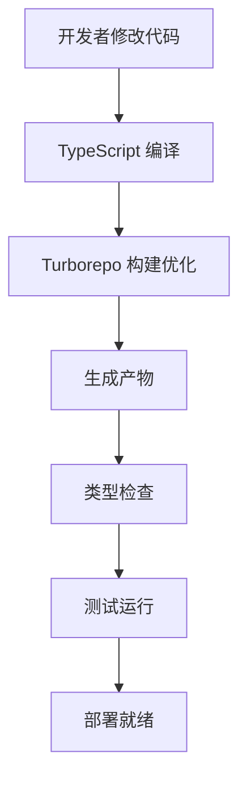

# 🏗️ 项目架构说明

本文档详细说明了加拿大驾考App的Monorepo架构设计。

## 📋 架构概览

```
┌─────────────────────────────────────────────────────────────┐
│                        Root Workspace                       │
│                     (canadian-driving-test)                 │
├─────────────────────────────────────────────────────────────┤
│  📦 Bun Workspaces + Turborepo + TypeScript References     │
└─────────────────────────────────────────────────────────────┘
                              │
                              ▼
┌─────────────────┬─────────────────┬─────────────────────────┐
│   📱 Apps       │   📦 Packages   │       🛠️ Tools         │
├─────────────────┼─────────────────┼─────────────────────────┤
│ • mobile        │ • shared        │ • Turborepo             │
│ • admin (待创建) │ • database      │ • TypeScript            │
│                 │                 │ • Drizzle Kit           │
└─────────────────┴─────────────────┴─────────────────────────┘
```

## 🎯 设计原则

### 1. **类型安全优先**
- 所有数据结构在 `shared` 包中定义
- 数据库 schema 自动生成 TypeScript 类型
- 编译时和运行时双重类型验证

### 2. **代码复用最大化**
- 业务逻辑、验证规则、常量在各应用间共享
- 避免重复代码，确保一致性

### 3. **开发体验优化**
- 统一的构建和部署流程
- 快速的类型检查和热重载
- 清晰的依赖关系

## 📦 包职责详解

### 🏠 根工作空间 (Root Workspace)

**职责**: 
- 管理所有子包的依赖
- 提供统一的脚本入口
- 配置构建工具链

**关键文件**:
```
package.json          # Workspace 配置和脚本
turbo.json           # 构建优化配置
tsconfig.json        # TypeScript 根配置
```

### 📱 Apps - 应用层

#### `apps/mobile` - React Native 应用

**职责**:
- 用户界面和交互逻辑
- 移动端特定功能 (相机、推送等)
- 本地状态管理 (Zustand)

**技术栈**:
```typescript
├── Expo Router        # 路由管理
├── NativeWind         # 样式系统
├── Zustand           # 状态管理
├── React Query       # 数据获取
└── Expo SDK          # 原生功能
```

**目录结构**:
```
apps/mobile/
├── app/              # 页面路由 (Expo Router)
├── components/       # 可复用组件
├── hooks/           # 自定义 Hooks
├── stores/          # Zustand 状态管理
├── utils/           # 移动端工具函数
└── assets/          # 静态资源
```

#### `apps/admin` - Next.js 管理后台 (待创建)

**职责**:
- 管理员界面
- 题库管理
- 用户数据分析
- API 服务提供

**技术栈**:
```typescript
├── Next.js 14        # 全栈框架
├── NextAuth.js       # 认证系统
├── Tailwind CSS      # 样式框架
├── Drizzle ORM       # 数据库操作
└── Neon Database     # PostgreSQL 数据库
```

### 📦 Packages - 共享层

#### `packages/shared` - 共享类型和工具

**职责**:
- 定义所有业务类型
- 提供通用工具函数
- 数据验证规则 (Zod)
- 国际化资源

**类型定义**:
```typescript
types/
├── user.ts          # 用户相关类型
├── quiz.ts          # 测验相关类型
├── handbook.ts      # 手册相关类型
├── api.ts           # API 响应类型
└── index.ts         # 统一导出
```

**工具函数**:
```typescript
utils/
├── constants.ts     # 应用常量
├── validation.ts    # 验证函数
└── helpers.ts       # 通用辅助函数
```

**使用示例**:
```typescript
// 在移动端使用
import { User, Province, RegisterSchema } from 'shared';

// 在后端使用
import { API_ENDPOINTS, ERROR_CODES } from 'shared';
```

#### `packages/database` - 数据库层

**职责**:
- 数据库 Schema 定义
- 迁移文件管理
- 种子数据
- 数据库连接配置

**Schema 设计**:
```typescript
schema/
├── users.ts         # 用户表
├── quizzes.ts       # 测验表
├── handbooks.ts     # 手册表
└── index.ts         # 统一导出
```

**类型生成流程**:
```
1. 定义 Drizzle Schema → 
2. 生成迁移文件 → 
3. 自动生成 TypeScript 类型 → 
4. 在 shared 包中使用
```

## 🔄 数据流架构

```
┌─────────────────────────────────────────────────────────┐
│                    数据流向图                            │
└─────────────────────────────────────────────────────────┘

Database (Neon PostgreSQL)
    ↕️ (Drizzle ORM)
Admin Backend (Next.js API)
    ↕️ (HTTP/WebSocket)
Mobile Frontend (React Native)
    ↕️ (React Query)
Local State (Zustand)
    ↕️
UI Components
```

### 类型安全流

```
Database Schema (Drizzle)
    ↓ (自动生成)
TypeScript Types
    ↓ (导入)
Shared Package
    ↓ (工作区依赖)
Mobile App ←→ Admin App
```

## 🛠️ 开发工具链

### 构建系统



### 包依赖关系

```
database ← shared ← mobile
                 ← admin
```

**说明**:
- `database` 不依赖任何内部包
- `shared` 依赖 `database` 生成的类型
- `mobile` 和 `admin` 依赖 `shared` 包

## 🔐 类型安全保障

### 1. 编译时检查
```typescript
// 在 shared 包中定义
export interface User {
  id: string;
  email: string;
  province: Province;
}

// 在移动端使用 - 自动类型提示和检查
const user: User = {
  id: "123",
  email: "user@example.com",
  province: "AB" // 只能是预定义的省份
};
```

### 2. 运行时验证
```typescript
// 使用 Zod 进行运行时验证
const result = RegisterSchema.parse(formData);
// 如果数据不符合 schema，会抛出详细错误
```

### 3. 数据库类型安全
```typescript
// Drizzle ORM 提供类型安全的查询
const users = await db
  .select()
  .from(usersTable)
  .where(eq(usersTable.province, "AB"));
// users 的类型会自动推导为 User[]
```

## 🚀 扩展性设计

### 添加新应用
```bash
# 创建新应用
mkdir apps/new-app
cd apps/new-app

# 安装共享依赖
bun add shared workspace:*
bun add database workspace:*
```

### 添加新功能
1. 在 `shared` 中定义类型
2. 在 `database` 中添加 schema
3. 在各应用中实现功能
4. 享受端到端的类型安全

### 性能优化
- **Turborepo**: 增量构建和缓存
- **TypeScript Project References**: 快速类型检查
- **Bun**: 更快的包管理和运行时

## 📈 监控和维护

### 代码质量
```bash
bun run type-check    # TypeScript 类型检查
bun run lint          # 代码规范检查
bun run test          # 单元测试 (待添加)
```

### 依赖管理
```bash
bun outdated          # 检查过期依赖
bun audit             # 安全漏洞检查
```

---

这个架构确保了：
- ✅ 类型安全
- ✅ 代码复用
- ✅ 开发效率
- ✅ 维护性
- ✅ 扩展性 